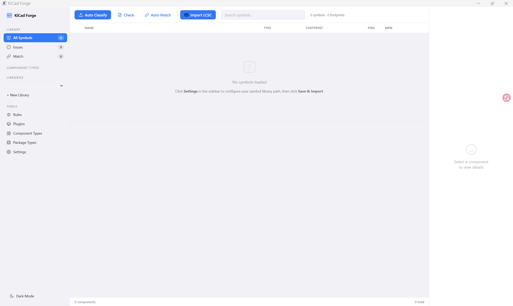
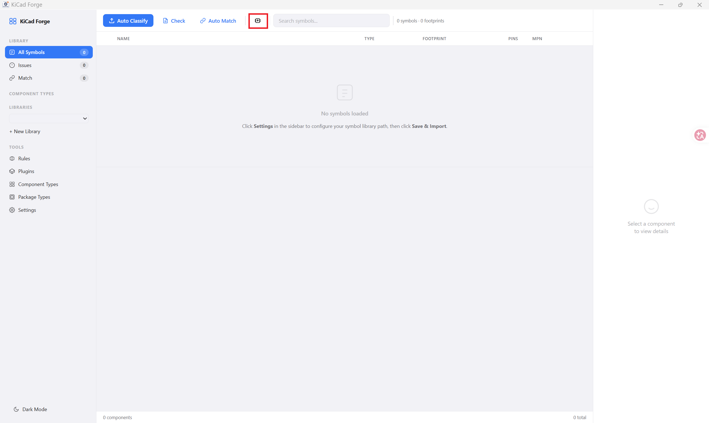
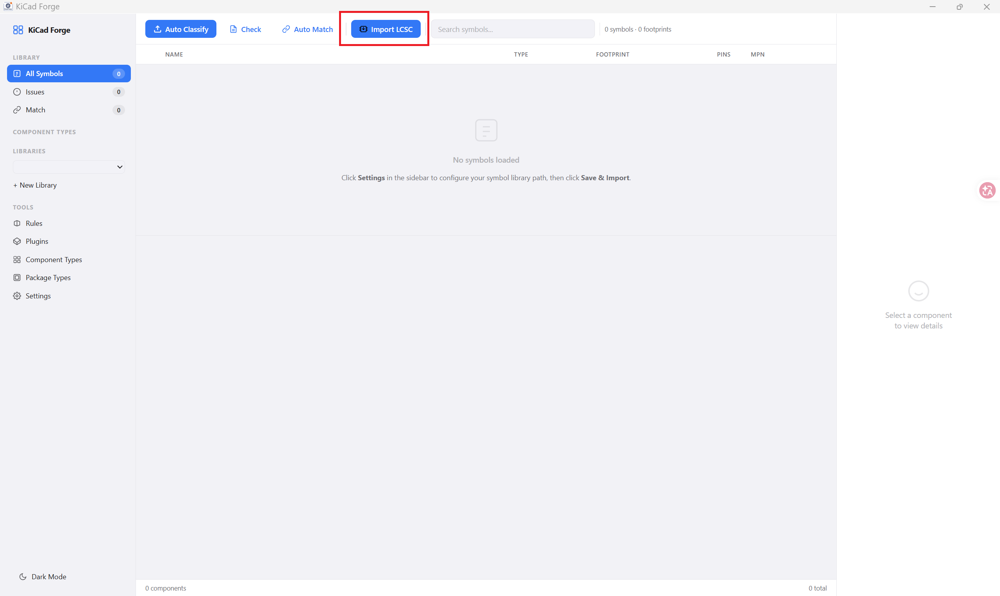
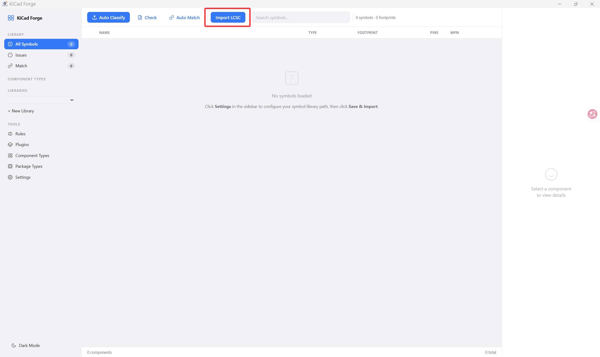

# KiCad Forge / KiCad 锻造

[中文](#中文) | [English](#english)

Desktop library manager for KiCad — browse, classify, and import symbols and footprints with a modern web UI and extensible plugin system.

KiCad 桌面端符号/封装库管理器——浏览、分类、导入，现代 Web 界面 + 插件系统。



---

## 中文

- [快速开始](#快速开始)
- [项目结构](#项目结构)
- [插件系统](#插件系统)
- [API](#api)
- [技术栈](#技术栈)
- [参与贡献](CONTRIBUTING.md)

### 快速开始

**环境要求**

- [MSYS2](https://www.msys64.org/) 安装 `mingw-w64-x86_64-clang`
- Python 3.10+（`pip install cairosvg Pillow`）
- Node.js（前端构建用）

**构建**

```powershell
# 首次：安装前端依赖
cd webui && npm install && cd ..

# 构建（Debug）
xmake f -m debug && xmake build

# 或一键脚本
.\make.ps1
```

输出：`build/mingw/x86_64/debug/KiCad_Forge.exe`。双击运行，WebView2 嵌入式窗口自动打开前端页面。exe 自包含——所需 DLL 自动复制到同级目录。

**VSCode 调试**

安装 CodeLLDB 扩展，`F5` 启动调试。配置文件在 `.vscode/`：

| 文件 | 用途 |
|---|---|
| `launch.json` | LLDB 启动配置 |
| `settings.json` | lldb 路径 |
| `tasks.json` | xmake 构建任务（`Ctrl+Shift+B`） |

### 项目结构

```
src/
├── api/               HTTP 路由（httplib）
├── core/              领域模型：Symbol / Footprint / Model3D
├── sexpr/             S-Expression 解析器（Tokenizer → DOM Builder → Writer）
├── parser/            KiCad 文件解析器（.kicad_sym / .kicad_mod）
├── storage/           SQLite 数据库层（Repository 模式）
├── classifier/        分类规则引擎
├── correspondence/    Symbol↔Footprint↔3D 关联追踪
├── services/          业务逻辑编排
├── plugin/            Python 插件基础设施
├── platform/          跨平台应用窗口（CRTP，Windows 下 WebView2）
└── util/              工具类（日志、Result、错误处理）

plugins/               插件包
webui/                 React 19 + Vite 前端
resources/             Windows 资源文件 + app.ico（构建时自动生成）
scripts/               svg2ico.py
```

### 插件系统

> ⚠️ 安全警告：插件以独立 Python 进程运行，拥有与主程序相同的文件系统访问权限。仅安装来自可信来源的插件，恶意插件可能读取、篡改或删除任意文件。

插件放在 `plugins/` 目录下，每个插件一个文件夹，包含 `manifest.json` + Python 脚本。后端通过 CLI 调用：`python plugin.py <action> '<json_args>'`，插件输出 JSON 到 stdout。

**manifest.json**

```json
{
  "id": "com.kicad_forge.lcsc_import",
  "name": "LCSC Component Importer",
  "version": "1.0.0",
  "entry": "plugin.py",
  "icon": "icon.svg",
  "capabilities": ["import"],
  "one_click": true,
  "actions": [
    {
      "id": "import",
      "name": "Import LCSC",
      "trigger": "dialog",
      "button": { "show": true, "style": "both" },
      "schema": {
        "fields": [
          { "key": "lcsc_id", "label": "LCSC Part Number", "type": "text", "required": true },
          { "key": "target_library", "label": "Target Library", "type": "library_picker", "required": true }
        ]
      }
    }
  ]
}
```

| 字段 | 说明 |
|---|---|
| `actions[].trigger` | `"dialog"` 弹窗表单 / `"inline"` 一键执行 / `"panel"` 侧边栏 |
| `actions[].button.style` | `"icon"` / `"text"` / `"both"` |

**style：icon**


**style：both**


**style：text**


### API

| 端点 | 方法 | 说明 |
|---|---|---|
| `/api/status` | GET | 健康检查 / 心跳 |
| `/api/symbols` | GET | 符号列表（支持 `?q=`、`?library=`） |
| `/api/libraries` | GET/POST | 库的增删查改 |
| `/api/plugins` | GET | 插件列表 |
| `/api/plugins/{id}/icon` | GET | 插件图标 |
| `/api/plugins/execute` | POST | 执行插件 action |
| `/api/classify` | POST | 运行分类规则 |
| `/api/check` | POST | 检查 Symbol↔Footprint↔3D 关联 |
| `/api/settings` | GET/POST | 读写配置 |
| `/api/import` | POST | 导入目录（`?dir=`） |

### 技术栈

| 层 | 选择 |
|---|---|
| 语言 | C++23 |
| 编译器 | clang 22（MSYS2，MinGW 目标） |
| 构建 | xmake |
| 前端 | React 19 + Vite |
| 数据库 | SQLite3 |
| HTTP | httplib（header-only） |
| 日志 | spdlog |
| WebView | [webview/webview](https://github.com/webview/webview)（Windows 下为 WebView2 Runtime） |
| 许可证 | MIT |

---

## English

- [Quick Start](#quick-start)
- [Architecture](#architecture)
- [Plugin System](#plugin-system)
- [API](#api-1)
- [Tech Stack](#tech-stack)
- [Contributing](CONTRIBUTING.md)

### Quick Start

**Prerequisites**

- [MSYS2](https://www.msys64.org/) with `mingw-w64-x86_64-clang`
- Python 3.10+ (`pip install cairosvg Pillow`)
- Node.js

**Build**

```powershell
# Install frontend dependencies
cd webui && npm install && cd ..

# Debug build
xmake f -m debug && xmake build

# Or use the script
.\make.ps1
```

Output: `build/mingw/x86_64/debug/KiCad_Forge.exe`. Double-click to run. The app opens in an embedded WebView2 window. Required DLLs are copied alongside the exe automatically.

**VSCode Debugging**

Install the CodeLLDB extension and press `F5`. Config files in `.vscode/`:

| File | Purpose |
|---|---|
| `launch.json` | LLDB launch config |
| `settings.json` | lldb path override |
| `tasks.json` | xmake build task (`Ctrl+Shift+B`) |

### Architecture

```
src/
├── api/               HTTP routes (httplib)
├── core/              Domain models: Symbol, Footprint, Model3D
├── sexpr/             S-Expression parser (Tokenizer → DOM Builder → Writer)
├── parser/            KiCad file parsers (.kicad_sym / .kicad_mod)
├── storage/           SQLite database (Repository pattern)
├── classifier/        Classification rule engine
├── correspondence/    Symbol↔Footprint↔3D relationship tracker
├── services/          Business logic orchestration
├── plugin/            Python plugin infrastructure
├── platform/          Cross-platform app window (CRTP, WebView2 on Windows)
└── util/              Utilities (logging, Result, errors)

plugins/               Plugin bundles
webui/                 React 19 + Vite frontend
resources/             Windows resource file + auto-generated app.ico
scripts/               svg2ico.py
```

### Plugin System

> ⚠️ Security: Plugins run as independent Python processes with the same filesystem access as the host application. Only install plugins from trusted sources — malicious plugins can read, modify, or delete arbitrary files.

Plugins live in `plugins/` as folders with `manifest.json` + Python scripts. The backend invokes them via CLI: `python plugin.py <action> '<json_args>'`. Plugin output is JSON on stdout.

See the [中文 Plugin System](#插件系统) section for the manifest schema and field reference.

Supported field types: `text`, `library_picker`, `select`, `file_picker`.

### API

| Endpoint | Method | Description |
|---|---|---|
| `/api/status` | GET | Health check / heartbeat |
| `/api/symbols` | GET | List symbols (`?q=`, `?library=`) |
| `/api/libraries` | GET/POST | CRUD libraries |
| `/api/plugins` | GET | List plugins |
| `/api/plugins/{id}/icon` | GET | Plugin icon |
| `/api/plugins/execute` | POST | Execute plugin action |
| `/api/classify` | POST | Run classification |
| `/api/check` | POST | Check symbol↔footprint↔3D links |
| `/api/settings` | GET/POST | Read/write settings |
| `/api/import` | POST | Import directory (`?dir=`) |

### Tech Stack

| Layer | Choice |
|---|---|
| Language | C++23 |
| Compiler | clang 22 (MSYS2, MinGW target) |
| Build | xmake |
| Frontend | React 19 + Vite |
| Database | SQLite3 |
| HTTP | httplib (header-only) |
| Logging | spdlog |
| WebView | [webview/webview](https://github.com/webview/webview) (WebView2 Runtime on Windows) |
| License | MIT |
